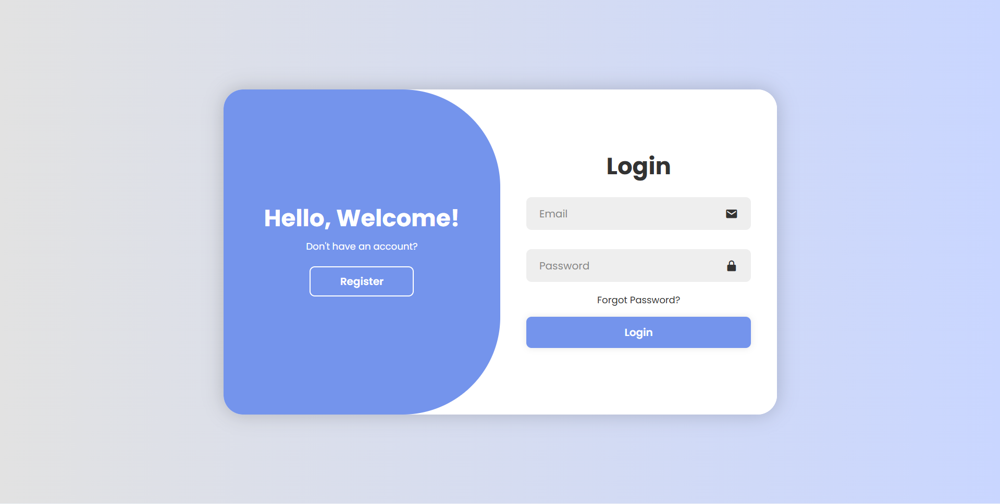
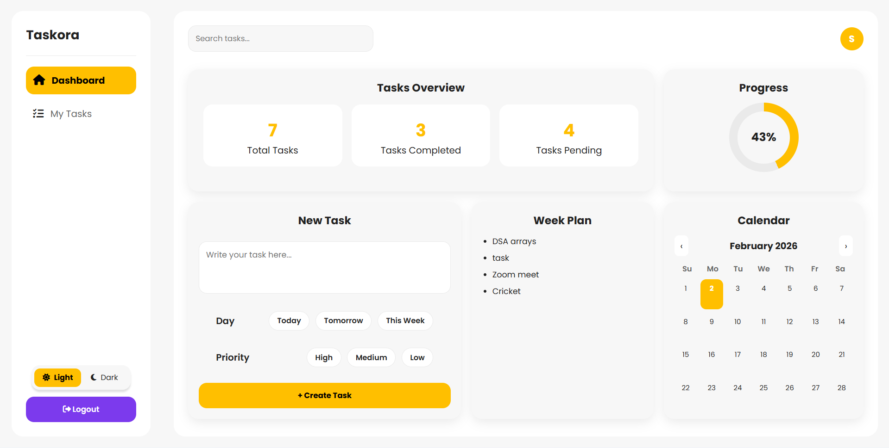
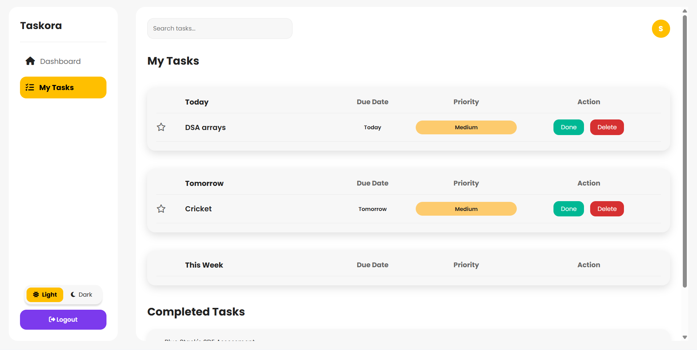

# Taskora – Secure Task Management System

Taskora is a modern **full-stack task management web application** built using **Java Spring Boot**, **JWT Authentication**, and **MySQL**, with a clean productivity-focused dashboard UI.

It allows users to securely register, log in, create tasks, pin important tasks, track completion progress, and manage daily productivity efficiently.

---

## Features

- Secure User Authentication (Register/Login)  
- JWT-based Protected Dashboard Access  
- Task Creation with Priority + Day Planning  
- Pin Tasks to Keep Important Ones on Top  
- Mark Tasks as Completed  
- Delete Tasks Instantly  
- Real-time Task Analytics (Total / Pending / Completed)  
- Weekly Plan View  
- Dark Mode / Light Mode Toggle  
- Modern Sidebar Dashboard UI  
- Fully Integrated with MySQL Database  

---

## Tech Stack

### Backend
- Java   
- Spring Boot  
- Spring Security  
- JWT Authentication  
- JPA / Hibernate  
- REST APIs  

### Database
 MySQL  

### Frontend
 HTML5 - CSS3 - JavaScript (Vanilla JS)   

---

## Screenshots

### Login & Registration Page


---

### Dashboard Overview


---

### My Tasks Section


---

## Setup & Installation Guide (Backend + Frontend)

Taskora is a modern **full-stack Spring Boot + MySQL task management system** with secure authentication and a productivity-focused dashboard.

---

## Backend Setup (Spring Boot + MySQL)

### Clone Repository

```bash
git clone https://github.com/your-username/taskora-secure-task-management-system.git
cd taskora-secure-task-management-system
```

### Create database in MySQL:

```sql
CREATE DATABASE taskora;
```
### Update credentials in:

```css
backend/src/main/resources/application.yml
```

### Run backend:

```bash
cd backend
mvn spring-boot:run
```

### Backend runs at:

```arduino
http://localhost:8081
```

## Frontend (HTML/CSS/JS)

### Open:

```bash
frontend/index.html
```

### Run using VS Code Live Server:

```arduino
http://127.0.0.1:5500/frontend/index.html
```

---

## REST API Endpoints

### Authentication APIs

| Method | Endpoint         | Description    |
|--------|------------------|---------------|
| POST   | `/auth/register` | Register User |
| POST   | `/auth/login`    | Login User    |

---

### Task Management APIs

| Method | Endpoint              | Description         |
|--------|------------------------|---------------------|
| GET    | `/tasks/{email}`       | Fetch user tasks    |
| POST   | `/tasks`               | Create new task     |
| PUT    | `/tasks/{id}/pin`      | Pin / Unpin task    |
| PUT    | `/tasks/{id}/complete` | Mark task completed |
| DELETE | `/tasks/{id}`          | Delete task         |

---

## Sample Task JSON

```json
{
  "title": "Finish project report",
  "groupName": "Today",
  "due": "Today",
  "priority": "High",
  "pinned": false,
  "done": false,
  "userEmail": "user@example.com"
}
```

---
*Thank you for checking out this project!*
